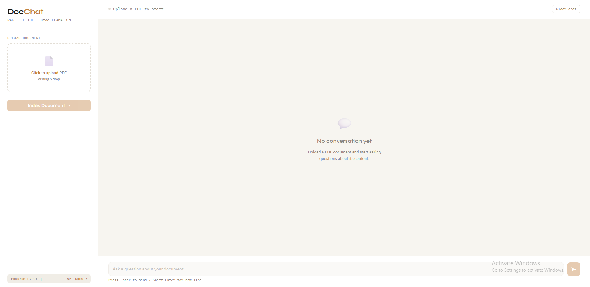

# 🤖 RAG Chatbot

A production-ready chatbot that answers questions based on your PDF documents — powered by **TF-IDF retrieval** and **Groq LLaMA 3.1**.

🌐 **[Live Demo](https://sickked-c.github.io/rag-chatbot/)** · 📖 **[API Docs](https://rag-chatbot-wqsh.onrender.com/docs)**

---

## 🖼️ Demo



---

## 🔍 How it works

```
PDF Upload
    ↓
Split into chunks (LangChain RecursiveTextSplitter)
    ↓
TF-IDF Vectorization (scikit-learn)
    ↓
User asks a question
    ↓
Cosine Similarity → Top 3 relevant chunks
    ↓
Groq LLaMA 3.1 8B → Answer based on context
```

---

## ✨ Features

- 📄 Upload any PDF document
- 🔍 TF-IDF retrieval — no GPU, no heavy models
- 🤖 Groq LLaMA 3.1 8B for accurate answers
- 💬 Clean chat UI (GitHub Pages)
- ⚡ Fast & lightweight — runs on free tier

---

## 🛠️ Tech Stack

| Component | Technology |
|-----------|-----------|
| API Framework | FastAPI |
| LLM | Groq LLaMA 3.1 8B |
| Retrieval | TF-IDF + Cosine Similarity |
| PDF Processing | LangChain + PyPDF |
| Deploy | Render (Python runtime) |
| UI Demo | GitHub Pages |

---

## 🚀 API Usage

### Upload PDF

```bash
POST /upload

curl -X POST https://rag-chatbot-wqsh.onrender.com/upload \
  -F "file=@document.pdf"
```

**Response:**
```json
{
  "message": "PDF uploaded and indexed!",
  "filename": "document.pdf",
  "chunks": 42
}
```

### Ask a question

```bash
POST /ask?question=your question here

curl -X POST "https://rag-chatbot-wqsh.onrender.com/ask?question=What is this document about?"
```

**Response:**
```json
{
  "question": "What is this document about?",
  "answer": "This document discusses...",
  "sources": [
    { "content": "Relevant excerpt from the document..." }
  ]
}
```

---

## 📦 Installation

```bash
# 1. Clone repo
git clone https://github.com/Sickked-C/rag-chatbot.git
cd rag-chatbot

# 2. Create virtual environment
python -m venv .venv
.venv\Scripts\activate       # Windows
source .venv/bin/activate    # Mac/Linux

# 3. Install dependencies
pip install -r requirements.txt

# 4. Setup environment
cp .env.example .env
# Add your GROQ_API_KEY

# 5. Run
uvicorn main:app --reload
```

Visit **http://localhost:8000/docs**

---

## ⚙️ Environment Variables

```env
GROQ_API_KEY=your_groq_api_key_here
```

Get your free API key at **[console.groq.com](https://console.groq.com)**

---

## 📁 Project Structure

```
.
├── main.py          # FastAPI + TF-IDF + Groq pipeline
├── index.html       # Web UI demo
├── requirements.txt
├── .env.example
├── render.yaml      # Render deployment config
└── README.md
```

---

## 🗺️ Roadmap

- [x] PDF upload & indexing
- [x] TF-IDF retrieval
- [x] Groq LLaMA integration
- [x] Web UI demo
- [ ] Multi-document support
- [ ] Conversation history

---

## 📄 License

MIT License